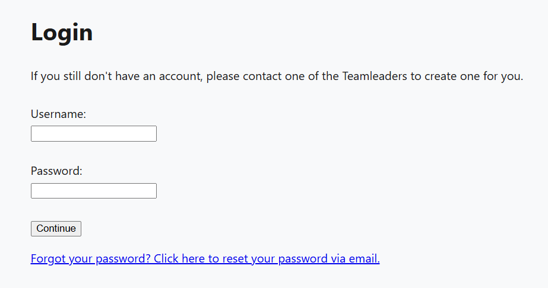
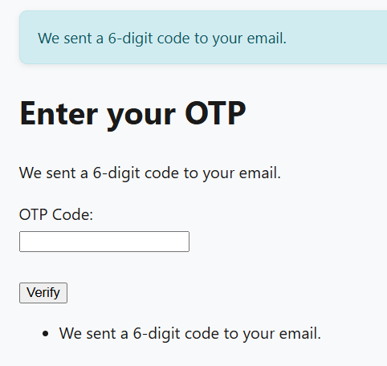
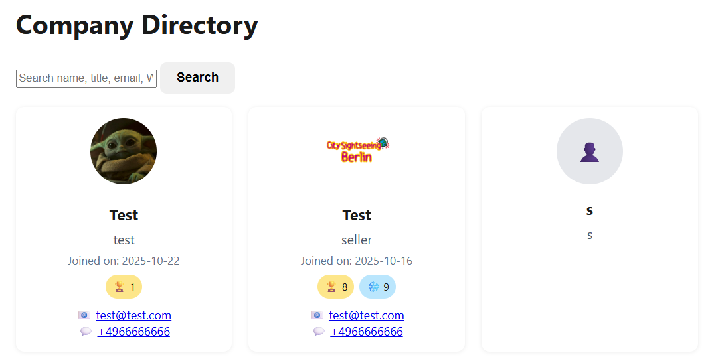
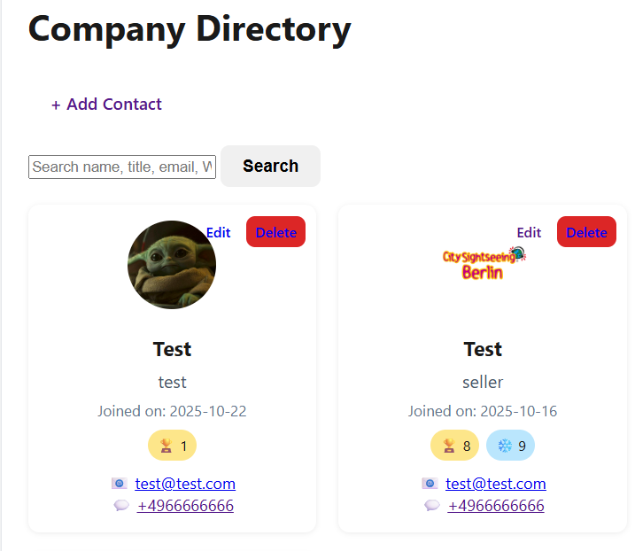
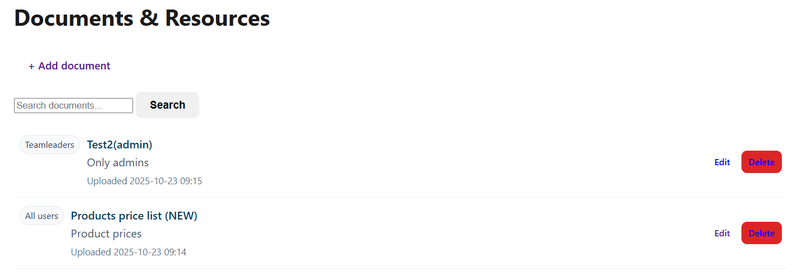
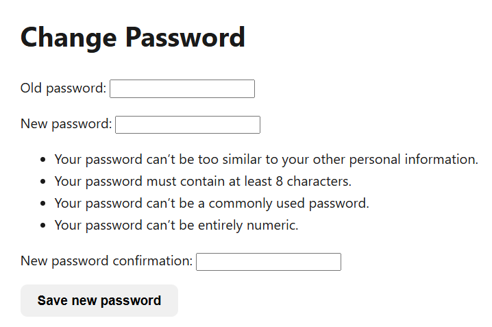

# BCT Internal Platform

Internal web platform developed with Django for Berlin City Tour GmbH as part of a university practical project.

## Overview

The platform centralizes internal communication and tools for sellers and team leaders. It includes modules for feedback, documents, team events, work safety information, news, and employee contact information.

## Features

- OTP-based login verification
- Role-based access control
- Feedback and support system
- Document management
- Team event management
- News and announcements
- Work safety information
- Team directory

## Technologies

- Python
- Django
- SQLite
- HTML
- CSS
- Git/GitHub

## Security Features

- One-Time Password (OTP) verification by email
- Role-based access for sellers and team leaders
- Restricted access to admin/teamleader areas
- Password reset and password change functions

## Screenshots

### Login Page


### OTP Authentication


### Seller Dashboard


### Teamleader Dashboard


### Documents Management


### Password Management


### User Feedback


## Setup

```bash
pip install -r requirements.txt
python manage.py migrate
python manage.py runserver
```

## Note

Sensitive company data, real user information, uploaded files, and production configuration values were removed before publishing this repository.

## Author

Mohamed Habib  
IT-Security Student – Berliner Hochschule für Technik (BHT)
